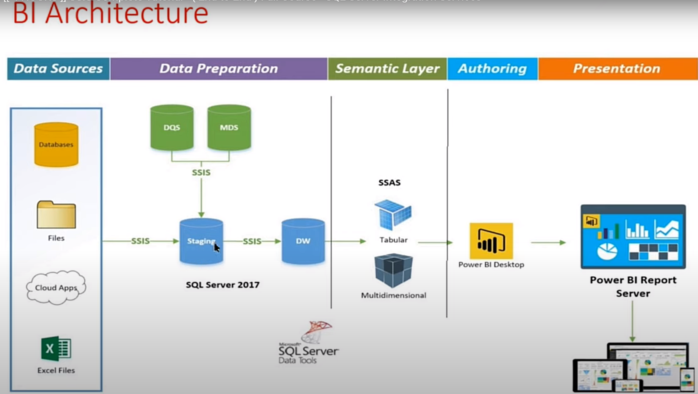

# SSIS - SQL Server Integration Services

SSIS est un outil qui sert lors de la préparation des données à extraire, transformer et charger les données dans les projet d'entrepôts de données, des projets de migration des données ou dans les activités de maintenance des données.

