# Bien modéliser et implémenter votre Entrepôt de Données de A à Z

## Configurons notre Environnement de Développement

Composants de mon environnement de travail
1. Microsoft Windows 10 Professionnel
2. Microsft SQL Server Developper 2019 (DBMS)
3. Microsoft SQL Server Management Studio 19.1 (SSMS)
4. Microsoft SQL Server Data Tool for Visual Studio 2017 (SSIS, SSAS)
5. Microsoft Power BI Desktop
6. Git et GitHub

### [Installons SQL Server Data Tool for Visual Studio 2017 (SSDT 2017)](https://en.dirceuresende.com/blog/como-corrigir-erro-na-instalacao-do-sql-server-data-tools-ssdt-2017-setup-failed-incorrect-function-0x80070001/)

Télécharger SSDT 2017 (SSDT-Setup-ENU.exe) ici https://go.microsoft.com/fwlink/?linkid=2169967&WT.mc_id=DP-MVP-5003166

Télécharger (vs_sql.exe) ici https://aka.ms/vs/15/release/vs_sql.exe

Ouvrir l'invite de commande en tant que administrateur

Naviguer dans le dossier où vs_SQL.exe a été téléchargé
~~~sh
cd C:\Users\Admin\Sync\cdnza\data_analysis\entrepot_de_donnees
~~~

Exécuter la commande suivante
~~~sh
vs_SQL.exe --layout C:\SSDT2017\ --lang en-us
~~~

Exécuter la commande suivante et suivant les instruction de l'assisatant pour installer Microsoft Visual Studio 2017
~~~sh
cd C:\SSDT2017\
vs_SQL.exe --NoWeb
~~~

Installer Microsoft SQL Server Data Tools sans oublier de cocher les option SSAS, SSRS, et SSIS lors que l'assistant va démarrer.

### [Installer SQL Server Developer Edition](https://www.microsoft.com/en-us/sql-server/sql-server-downloads)
NB: Cocher l'option Integration Services afin que 

### [Installer SQL Server Management Studio (SSMS)](https://learn.microsoft.com/en-us/sql/ssms/download-sql-server-management-studio-ssms?view=sql-server-ver16)

Sommaire
- Les notions fondamentales
- Expliquer l'architecture d'un entrepôt de données
- Définir les termes techniques usuels
- Etudier un cas pratique à l'aide du jeux de données "Adventure works"
- Modéliser un entrepôt de données
- Implémenter un entrepôt de données
- Extraire Transformer et Charger les données (SSIS)
- Analyser les données (SSAS)
- Planifier les tâches (Power BI)
- Conclure

## Les notions fondamentales

Quelle est la difference entre une base de donnees et un entrepot de donnees?

Tandis qu'une `base de donnees` est plus appropriee pour le traitement des transactions en ligne (OLTP) car: 
- elle a une structure hautemnent normalisees afin d'accelerer les transaction,
- ses donnees sont non validees et non normalisees,
- elle ne peut pas sauvegarder ou traiter les donnees historiques,
- elle a un indexage minimal pour acceler la modification des donnees lors des transactions

Un `entrepot de donnees` est optimise pour le traitement analytique en ligne (OLAP) car:
- il a une structure denormalisees afin d'accelerer les requetes,
- ses donnees sont validees et normalisees,
- il peut sauvegarder les donnees historiques,
- il a un indexage maximal pour acceler la lecture des donnees lors des requetes

Qu'est ce qu'entrepôt de données?
- Un `entrepôt de données - Data Warehouse (DW)` est un dépôt central de données intégrées provenant d'une ou de plusieurs sources hétéogènes (CRM, ERP, Excel, Website). C'est un composant essentiel d'intelligence économique qui est utilisé pour créer des rapports et analyser les données. 
- L'`intelligence économique - Business Intelligence (BI)`est à son tour l'ensemble des stratégies et technologies utilisées par les entreprises pour analyser les données concernant leurs affaires. Les entrepôts de données permettent d'implémenter les solutions pour d'intelligence économique.

Pourquoi avons nous besoins d'un entrepôt de données?
- Pour intégrer plusieurs sources de données différentes
- Pour éviter que les utilisateurs exécutent les rapports directement sur le système opérationnel (ex. site web de la banque), parce que ceci peut créer des problèmes de performance.
- Pour avoir une version unique de la vérité à propos de vos données
- Pour regrouper les données historiques en un seul endroit afin de pouvoir mieux les gérer
- Pour réduire le risque que les utilisateurs du rapport fassent un usage abusif ou corrompent les données de transaction.
- Permettre aux utilisateurs finaux de créer leurs propres rapports sans impliquer un informaticien dans les processus (Self Service BI).
- Parce que c'est l'endroit adéquat pour créer et sauvegarder les métadonnées et les logiques d'entreprises
- Pour améliorer la qualité des données en nettoyant ceux ci lors de l'importation dans l'entrepôt de données
- Parce que c'est une technologie qui a fait ses preuves.

## Expliquons l'architecture d'un entrepôt de données

### L'Architecture conventionnelle

Le diagramme ci-dessus illustre l'architecture classique des entrepôts de données dans les entreprises. Partant de la gauche vers la droite, nous avons diverses sources hétéroges qui contiennent les données par rapport aux activités d'une entreprise pendant une période de temps données. Nous utiliserons Microsoft Visual Studio Data Tool for Visual Studio 2017 pour préparer ces données en d'autres termes pour extraire ces données, les transformer en données exploitables par les outils d'analyse et les charger dans une base de données SQL Server 2017 (SQL). Cette étape s'appelle l'intégration des données (ETL / SSIS). Par la suite nous allons construire notre modèle tabulaire (recommandé par microsoft car suffisant pour la majorité des tâches) ou multidimentionnel de ces données dans SQL Server (SSAS). About de la chaine de traitement nous allons donc utiliser Microsoft Power BI pour créer des rapports et des tableaux de bord (DAX) pertinents pour les mettre à disposition de nos utilisateurs finaux qui les consommeront à travers leurs navigateurs web ou leurs smartphone.

### L'Architecture moderne
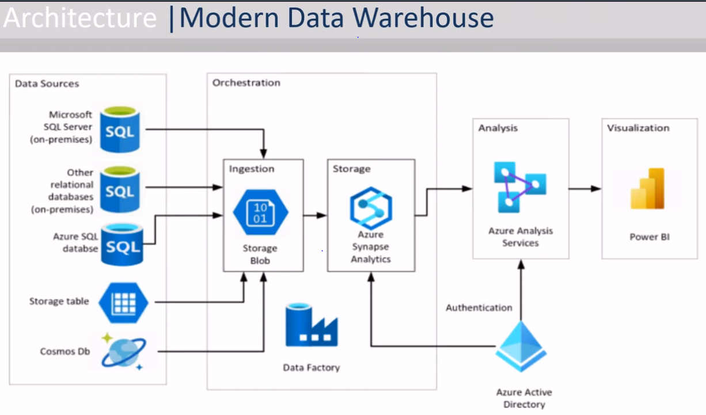
Nous constatons ici le flux de tâches à effectuer reste identique entre cette architecture et de la précédente tandis que les outils utilisés diffères. Le traitement des données dans un entrepôt de données moderne se fait essentiellement dans le cloud parce que les sources de données sont aussi stocées dans des espaces cloud.

### Définissons les termes techniques usuels

`SQL Server Integration Services (SSIS)` est un sevice d'extraction, transformation et chargement de données ETL (Extract Transform Load) qui permet de se connecter à n'importe quelle source de données (Excel, fichier plat csv, XML, base de données, etc.). Tandis que `ETL (Extract Transform Load)` est utilisé pour les solution d'entrepôts de données dans les locaux de l'entreprise, `ELT (Extract Load Transform)` est utilisé pour les solution de lac des données dans les technologies cloud.
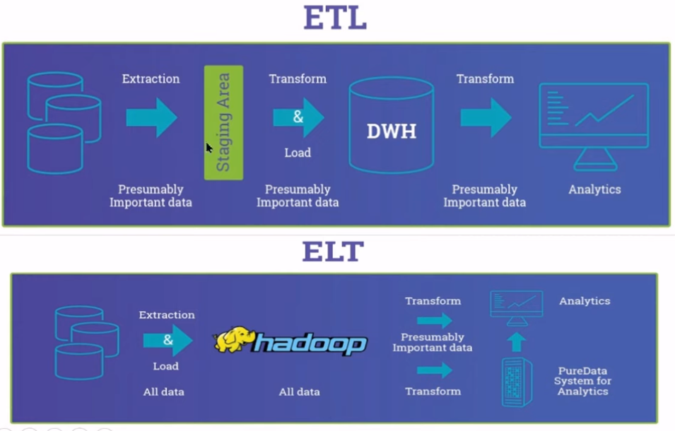

Une `zone de transit - eng. staging` est une zone de stockage intermédiaire utilisée pour le traitement des données au cours du processus d'extraction, de transformation et de chargement (ETL). La zone de mise à disposition des données se situe entre la ou les sources de données et la ou les cibles de données, qui sont souvent des entrepôts de données (DW), des datamarts (DM) ou d'autres référentiels de données.

Un `datamart` est un sous-ensemble d’un entrepôt de données destiné à fournir des données aux utilisateurs, et souvent spécialisé vers un groupe ou un type d'affaire.

Un `magasin de données opérationnelles - eng. operational data store (ODS)` est une base de données centrale qui fournit un instantané des données les plus récentes provenant de plusieurs systèmes transactionnels pour l'établissement de rapports opérationnels. Un cas pratique est l'architecture master-slave d'une base de données opérationnelle qui permet de repliquer la base de données principale en temps réel afin de permettre aux utilisateurs finaux d'exécuter leurs rapports sur un base de données secondaire de tel sorte que les activités opérationnnelles ne soientt pas perturbées.
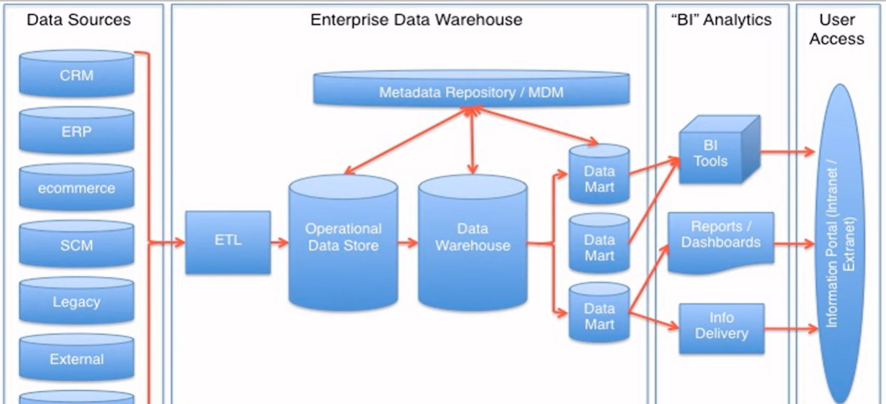

`SQL Server Analysis Services (SSAS)` est une composante importante de la suite d'intelligence d'affaires (BI) proposée par Microsoft permettant de créer des cubes OLAP pouvant être exploités par différents outils de forage, d'exploration de données et de tableaux de bord.

Le `traitement des transactions en ligne - eng. Online Transaction Processing (OLTP)` capture, stocke et traite les données des transactions en temps réel, tandis que le `traitement analytique en ligne - eng. Online Analytical Processing (OLAP)` utilise des requêtes complexes pour analyser les données historiques agrégées des systèmes OLTP. Un système OLTP est tabulaire (ex. le visuel tableau dans Powe BI) tandis qu'un système OLAP est cubique (ex. le visuel matrix dans Power BI).

Une `table de faits (ce que vous voulez analyser) - eng. fact table` contient des mesures ainsi que des clés étrangères de référence pour les tables de dimensions. Ces tables sont généralement des tables de transaction du système OLTP. Cependant, une `table de dimension (par laquelle vous voulez analyser)` est une entité commerciale qui possède ses propres attributs et cette table est liée au fait. Il s'agit généralement de tables de référence ou de tables de consultation dans le système OLTP.

L'objectif principal d'un schéma en étoile dans la conception d'un entrepôt de données est de construire une modélisation dimensionnelle. Le schéma en étoile découle de la conversion du modèle de relation entre entités du système OLTP afin de pouvois d'être utilisé dans systèmes OLAP pour accroite la vittesse des requêtes lors de la création des rapports. Cette conversion s'effectue en groupant toutes les tables de transactions pour former une table de fait contenant des attributs. Chaque attribut est une clée étrangére décrit par une table dimension associée.

Un `schéma en flocon de neige - eng. snow flake schema` est un `schéma en étoile - eng. star schema` dans lequel la table des faits n'est pas directement liées à toutes les tables de dimension.

`DAX (Data Analysis Expressions)` est le langage utilisé dans Power BI pour créer des formules et ainsi compléter un modèle de données pour répondre à une analyse.

## Etudions un cas pratique à l'aide du jeux de données "Adventure works"

"Adventure Works" est une entreprise multinationale de fabrication présentant les caractéristiques suivantes :
- Elle est répartie en 3 groupes, 6 régions et 10 territoires.
- Elle vend des produits répartis en 4 catégories, plus de 30 sous-catégories et plus de 500 produits.
- Elle compte plus de 15 000 clients.
- Elle est repartie en plusieurs départements parmi lesquels: achats et production, ressources humaines et ventes.

"Adventure Works" nous a chargé de lui construire un entrepôt de données robuste.

## Modélisons l'entrepôt de données

Quelques questions d'orientation
- Quel est le système source? -> AdventureWorks2014
- Comment fonctionne le processus d'entreprise?
- Quelles sont les attentes de l'entreprise? 
- Quels sont les différents domaines d'activité? -> les ventes et le ressources humaines
- Quels sont les faits de l'entreprise? -> les ventes et le ressources humaines
- Quels sont les dimensions de l'entreprise? -> les dimensions confirmées, les dimensions du moteur de stockage, les dimensions du jeu de rôle
- Quel est la la granularité de chaque noeud dans le système? -> granularité des quotidiens par produit et par employer

### Restaurons la sauvegarde du système OLTP "AdventureWorks2014" da la base de données

Téléchargeons le backup du système OLTP de l'entreprise "AdventureWorks2014" sur le GitHub officiel de Microsoft [AdventureWorks sample databases](https://github.com/Microsoft/sql-server-samples/releases/tag/adventureworks) et le sauvegarder temporairement dans le dossier "Downloads"

Naviguons dna le dossier C:\Program Files\Microsoft SQL Server\MSSQL15.MSSQLSERVER\MSSQL\
Copions et collons le fichier backup dans le sous-dossier "Backup"

Utilisons SQL Server Management Studio (SSMS) pour restaurer ce backup dans SQL Server Developer Edition. Etapes à suivre:
- Nous nous connectons à la base de données en utilisant vos identifiant Windows
- Nous faisons un click droit sur "Databases" et choisir "Restore Database"
- Dans la boîte de dialogue ouvert, nous choisissons l'option "Device" afin de sélectionner le fichier backup précédemment sauvegardé sur notre machine.
- Clickons sur "Vérifions Backup Media"
- Clickons "OK"
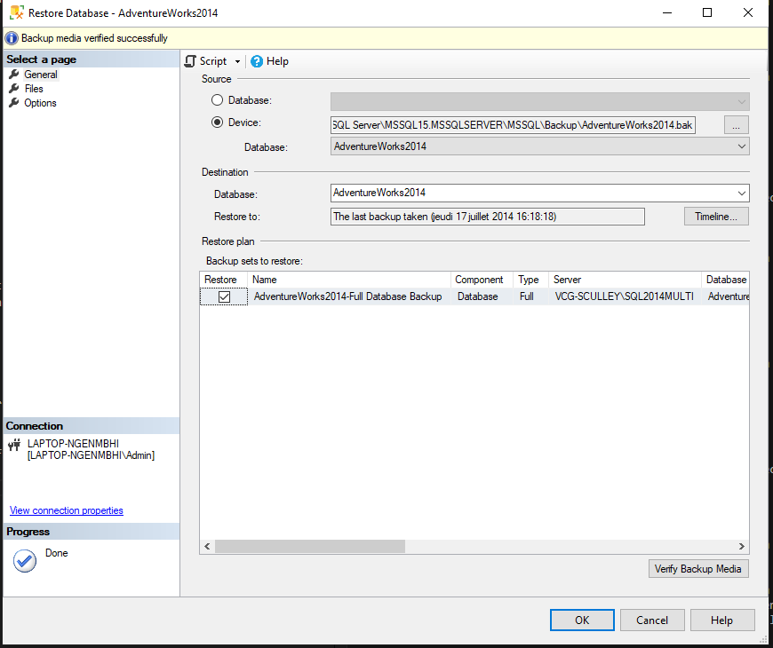
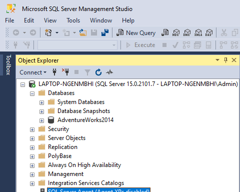

Analyser les données contenues dans les différentes tables pour de comprendre l'architecture du système source.

### Modélisons les Datamarts par secteur d'activités de l'entreprise

Modéliser le datamart des ventes (sales)
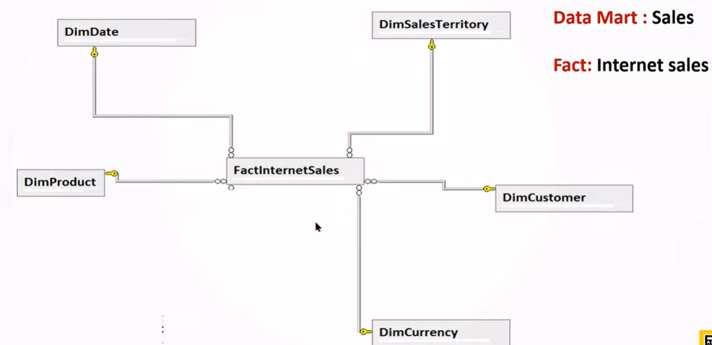
Il se compose des éléments impliqués dans un processus de vente et contient une table de fait pour les ventes en ligne (FactInternetSales) et l'autre pour les ventes sur site (FactResellerSales). 
FactInternetSales (FactResellerSales)
- DimCustomer (DimReseller)
- DimProduct
- DimDate
- DimTerritory
- DimCurrency

~~~sql
--- Autrement dit qui? (le client final ou le revendeur) a acheter quoi? (un produit) quand? (une date données) où? (un lieu géographique) par quel moyen? (en utilisant une monnaie données)

--- Vente en ligne
SELECT TOP (1) *
FROM [AdventureWorks2014].[Sales].[SalesOrderHeader]
WHERE OnlineOrderFlag = 1

--- Vente sur site
SELECT TOP (1) *
FROM [AdventureWorks2014].[Sales].[SalesOrderHeader]
WHERE OnlineOrderFlag = 0

SELECT *
FROM [AdventureWorks2014].[Sales].[Customer]
WHERE CustomerID = 29825

SELECT *
FROM [AdventureWorks2014].[Production].[Product]
WHERE ProductID IN (
SELECT ProductID
FROM [AdventureWorks2014].[Sales].[SalesOrderDetail]
WHERE SalesOrderID = 43659
)

SELECT *
FROM [AdventureWorks2014].[Sales].[SalesTerritory]
WHERE TerritoryID = 5

SELECT TOP (3) *
FROM [AdventureWorks2014].[Sales].[Currency]
~~~

## Implémentons l'entrepôt de données

### Description des étapes à suivre

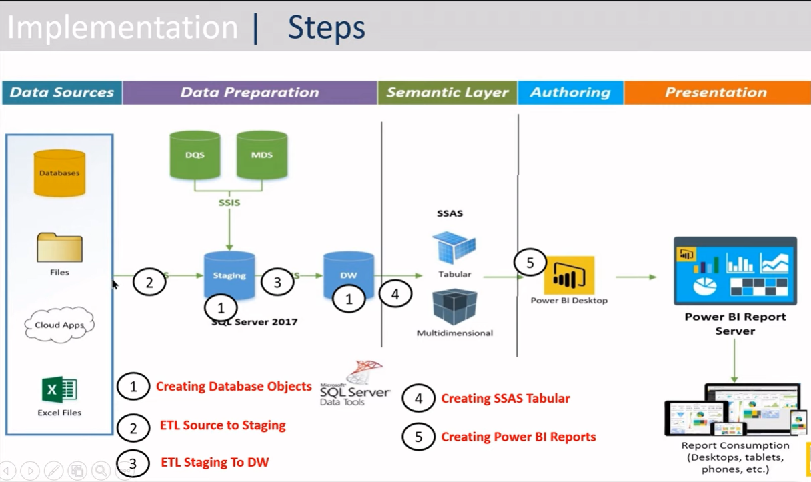
Créer les bases de données: Lors de la creation des objets de base données nous pourrions créer la base de données de zone de transit et la base de données de l'entrepôt de données sur le même serveur pour avoir une architecture simple ou sur différents serveurs en fonction des exigences de l'entreprise.

Charger les données de la source à la zone de transit. Migrer les données de la zone de transit vers l'entrepôt de données. Créer les modèles tablulaires. créer les rapports dans Power BI Desktop.

## Extrayons Transformons et Chargeons les données (SSIS)

### Créons le schéma de la zone de transit
Inspirons nous des l'architecture de nos datamarts et du schéma des tables correspondantes (ainsi que les tables associées par une clée étrangère) dans notre source afin de créer le schéma des tables de notre base de données de zone de transit. Suivons ces étapes pour extraire tous les schémas souhaités sous forme de script que nous allons modifier par la suite. 
- Clicke droit sur notre base de données source "AdventureWorks2014" > "Task" > "Generate script..." > "Next"
- Choisir l'option "Select specific database objects"
- Dérouler "Tables" et choisir les tables souhaitées
- Clicker "Next"
- Choisir l'option "Save as a script" et choisir l'enplacement de sauvegarde.
- Clicker "Next" 2 fois pour exécuter le script
- Clicker "Open" pour ovrir le script dans SSMS afin de l'adapter à nos besoins

FactInternetSales (FactResellerSales) 2
- SalesOrderID
- OnlineOrderFlag
- CustomerID 3
- SalesPersonID 4
- TerritoryID 5
- BillToAddressID 6
- rowguid
- ModifiedDate 
- DimCustomer (DimReseller)
    - CustomerID (PK)
    - PersonID (FK)
        - BusinessEntityID (PK) 8
        - TerritoryID (FK)
        - rowguid
        - ModifiedDate
    - StoreID (FK) 9
    - TerritoryID (FK)
    - rowguid
    - ModifiedDate
- DimProduct 10
    - ProductID
    - ProductSubcategoryID 11
    - ProductModelID 12
    - rowguid
    - ModifiedDate
- DimDate 7
- DimTerritory
    - TerritoryID
- DimCurrency 13

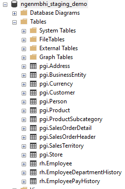

### Créons le schéma l'entrepôt de données
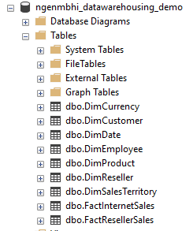

### Migrons les données de la base de données source vers la base de données de zone de transit
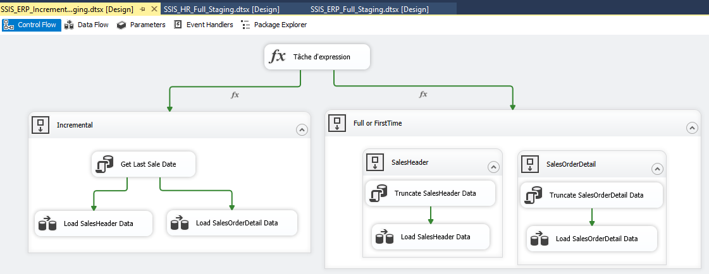
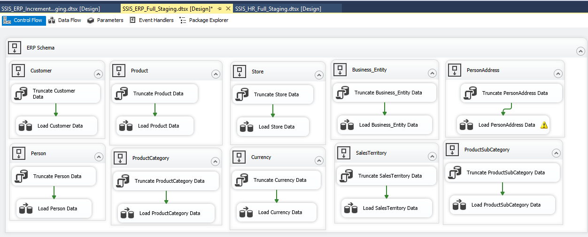
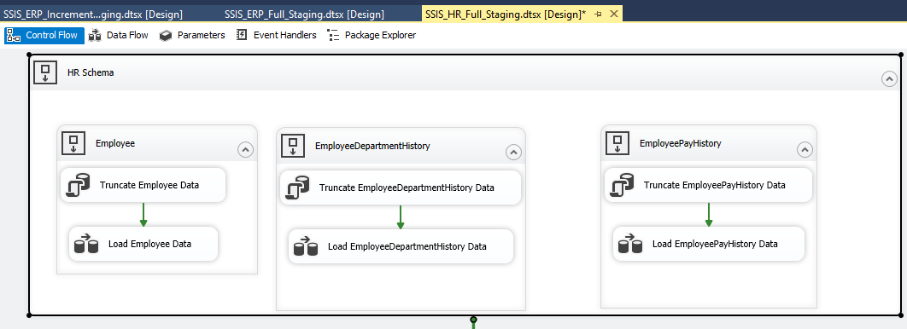

### Créons le Schéma étoile de l'entrepôt de données
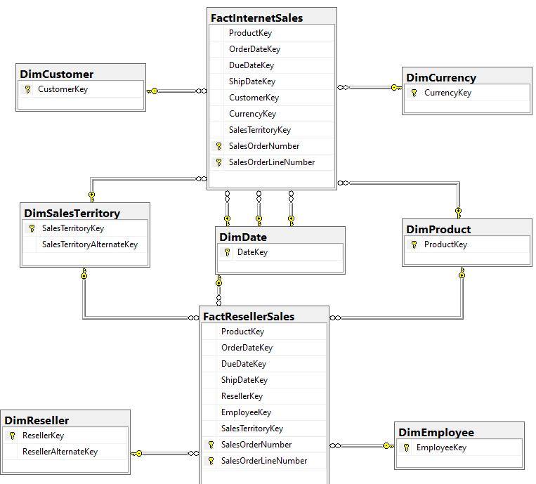

### Migrons les données de la base de données de zone de transit vers la de données de l'entrepôt de données
 
Deux cas peuvent se présenter à cette étape. Si les bases de données de la zone de transit et l'entrepôt de données se trouvent sur le même server nous pourrions aussi utiliser des procédures stockées (store procedure) pour alimenter pour alimenter notre entrepôt avec des nouveaux données. Cependant si ces derniers sont sur différents serveurs nous allons utiliser SSIS pour effectuer la migration des données.
Nous allons commencer par l'alimenter avec les données des tables de dimmention parce qu'elles sont référencées par les tables de fait comme nous pouvons le constater sur le schéma en étoile précédent.

Pour migrer les données de la table [AWN_STG_Demo][erp].[Currency] vers la table [AWN_DW_Demo][dbo].[DimCurrency] par exemple, nous allons implémenté la procédure stockée suivant dans le premier cas.
~~~sql
/*
Mettre à jour la base de données en
1) en ajoutant les données supplémentaires de la zone de transit s'il y en a
2) et en actualisant les noms de monnaie qui ont été modifiée dans la zone de transit
*/
CREATE PROCEDURE [dbo].[refresh_DimCurrency]
AS
BEGIN
SET NOCOUNT ON
-- 1)
INSERT INTO [AWN_DW_Demo].[dbo].[DimCurrency]
(
[CurrencyAlternateKey]
,[CurrencyName]
)
SELECT
[CurrencyCode]
,[Name]
FROM [AWN_STG_Demo].[erp].[Currency] stg (NOLOCK)
LEFT JOIN [AWN_DW_Demo].[dbo].[DimCurrency] dw (NOLOCK)
ON stg.CurrencyCode = dw.CurrencyAlternateKey
WHERE dw.CurrencyAlternateKey IS NULL
-- 2)
UPDATE dw
SET [CurrencyName] = [Name]
FROM [AWN_DW_Demo].[dbo].[DimCurrency] dw (NOLOCK)
INNER JOIN [AWN_STG_Demo].[erp].[Currency] stg (NOLOCK)
ON stg.CurrencyCode = dw.CurrencyAlternateKey
WHERE [CurrencyName] <> [Name]

SET NOCOUNT OFF
END
~~~

Dans le deuxième cas,  nous suivrons les étapes SSIS suivantes dans Microosoft Visual Studio contenant SSDT.
- Créer une connexion à notre base de données source [AWN_STG_Demo]
- Créer une connexion à notre base de données de destination [AWN_DW_Demo]
- Créer une tâche de requête SQL pour vider notre table de destionation avant chaque processus de migration
- Créer un flux de données qui aura notre table [AWN_STG_Demo][erp].[Currency] en entrée et la table [AWN_DW_Demo][dbo].[DimCurrency] en sortie
- Nous allons configuré les 2 noeux de notre flux afin que correspondre chaque attribut de la table d'entrée à un attribut adéquat dans la table de sortie
- Nous allons exécuté notre tâche de migration

## Analysons les données (SSAS)
## Planifions les tâches (Power BI)
## Clôturons notre projet

# Depannage des erreurs

## Probleme: Git push from Visual Studio Code
~~~sh
$ git push
remote: No anonymous write access.
fatal: Authentication failed for 'https://github.com/djomo-moungoue/entrepot-de-donnees-za.git/'
~~~

## Solution
Une méthode plus simple consiste à utiliser des jetons d'accès personnels sur GitHub. Cette fonctionnalité peut être configurée en allant dans votre compte GitHub → Paramètres → Paramètres du développeur → Jetons d'accès personnels → Générer un jeton d'accès personnel. Faites vos sélections de contrôle d'accès, générez, puis copiez et enregistrez votre nouveau jeton. Après cela, allez dans le répertoire de votre projet Git et entrez dans le terminal :
~~~sh
git remote set-url origin https://YOUR_TOKEN_HERE@github.com/your_user/your_project.git
~~~
source: https://stackoverflow.com/questions/60757334/git-push-from-visual-studio-code-no-anonymous-write-access-authentication-fai

